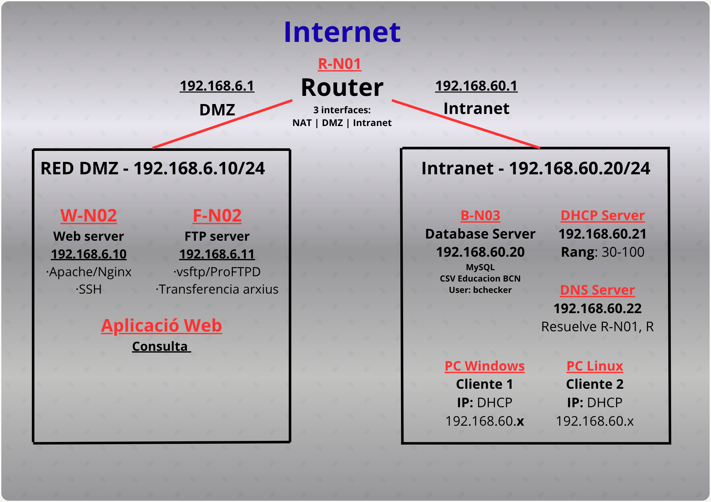

# ASIXc2AC--Projecte_P0.0

## Informació del Projecte

**Nom del Projecte:** P0.0-ASIXc2gC-Gnn  
**Durada:** 6 setmanes (fins el 18/11)  
**Sprints:** 3 sprints quinzenals (10h cadascun)  
**Grup:** Eduard, Hamza, Guim, Francesc

## Descripció

Projecte de desplegament d'infraestructura multicapa que inclou:
- Web Server
- Monitor de xarxes
- SSH
- Base de Dades (MySQL)
- DHCP
- DNS
- FTP

## Objectius

- Preparar infraestructura completa multicapa
- Implementar arquitectura de xarxa amb DMZ, Intranet i NAT
- Desplegar serveis de xarxa essencials
- Crear aplicació web de consulta de dades
- Gestionar projecte mitjançant sprints en ProofHub

## Arquitectura de Xarxa

### Esquema d'IPs - Xarxa 192.168.6.X

#### DMZ (192.168.6.10/24)
- **W-NCC (Web Server):** 192.168.6.10
- **F-NCC (FTP Server):** 192.168.6.11

#### Intranet (192.168.60.20/24)
- **B-NCC (Database Server):** 192.168.60.20
- **DHCP Server:** 192.168.60.21
- **DNS Server:** 192.168.60.22
- **Pool DHCP:** 192.168.60.30-100

#### Router
- **Hostname:** R-N01
- **Interfícies:** DMZ, Intranet, NAT

## Hardware Desplegat

### Servidors
- **W-NCC:** Web Server + SSH
- **B-NCC:** Base de Dades MySQL
- **F-NCC:** Servidor FTP
- **Servidors de Xarxa:** DHCP + DNS

### Clients
- PC Windows
- PC Linux

---

## Sprint 1 - Configuració Serveis de Xarxa

### Configuració DHCP Server

#### Pas 1: Instal·lació del servei DHCP

Instal·lació del paquet `isc-dhcp-server` al servidor Ubuntu.

---

#### Pas 2: Configuració del fitxer dhcpd.conf

Configuració del fitxer `/etc/dhcp/dhcpd.conf` amb el rang d'IPs (192.168.60.30-100), gateway (192.168.60.1), DNS (8.8.8.8, 4.4.4.4) i reserva estàtica per adminPC (192.168.60.20).

---

#### Pas 3: Verificació de l'estat del servei

Verificació que el servei DHCP està actiu i funcionant correctament (status active/running).

---

#### Pas 4: Configuració client Ubuntu

Configuració del client Ubuntu per obtenir IP automàticament via DHCP i DNS manual (192.168.60.20).

---

#### Pas 5: Verificació IP assignada - Client Ubuntu

Verificació que el client Ubuntu ha rebut la IP 192.168.60.30 del pool DHCP.

---

#### Pas 6: Verificació IP assignada - Client Windows

Verificació que el client Windows ha rebut la IP 192.168.60.31 del servidor DHCP amb gateway 192.168.60.1.

---

#### Pas 7: Comprovació del fitxer de leases

Comprovació del fitxer de leases que mostra l'assignació d'IP al client Windows (DESKTOP-JNU2BQU amb IP dinàmica).

---