# ASIXc2AC--Projecte_P0.0

## 📑 Índex

- [Informació del Projecte](#informació-del-projecte)
- [Descripció](#descripció)
- [Objectius](#objectius)
- [Arquitectura de Xarxa](#arquitectura-de-xarxa)
  - [Esquema d'IPs - Xarxa 192.168.6.X](#esquema-dips---xarxa-1921686x)
- [Hardware Desplegat](#hardware-desplegat)
- [Plan de Prevención de Riesgos Laborales](#plan-de-prevención-de-riesgos-laborales)
- [Configuració DNS Server (D-N03)](#configuració-dns-server-d-n03)
- [Configuració DHCP Server](#configuració-dhcp-server)
- [Configuració Router R-N01](#configuració-router-r-n01)

---

## Informació del Projecte

**Nom del Projecte:** P0.0-ASIXc2gC-Gnn  
**Durada:** 6 setmanes (fins el 18/11)  
**Sprints:** 3 sprints quinzenals (10h cadascun)  
**Grup:** Eduard, Hamza, Guim, Francesc

## Descripció

Projecte de desplegament d'infraestructura multicapa que inclou:
- Web Server
- Monitor de xarxes
- SSH
- Base de Dades (MySQL)
- DHCP
- DNS
- FTP

## Objectius

- Preparar infraestructura completa multicapa
- Implementar arquitectura de xarxa amb DMZ, Intranet i NAT
- Desplegar serveis de xarxa essencials
- Crear aplicació web de consulta de dades
- Gestionar projecte mitjançant sprints en ProofHub

## Arquitectura de Xarxa

### Esquema d'IPs - Xarxa 192.168.6.X

#### DMZ (192.168.6.0/24)
- **Gateway Router (DMZ):** 192.168.6.1
- **W-N02 (Web Server):** 192.168.6.10
  - Apache/Nginx
  - SSH
  - Aplicació Web de Consulta
- **F-N02 (FTP Server):** 192.168.6.11
  - vsftpd/ProFTPD
  - Transferència arxius

#### Intranet (192.168.60.0/24)
- **Gateway Router (Intranet):** 192.168.60.1
- **Intranet Host:** 192.168.60.20
- **B-N03 (Database Server):** 192.168.60.15
  - MySQL
  - CSV Educación BCN
  - User: bchecker
- **DHCP Server:** 192.168.60.20
  - Pool DHCP: 192.168.60.30-100
- **DNS Server:** 192.168.60.20
  - Resuelve R-N01, R...
- **PC Windows (Cliente 1):** IP DHCP (192.168.60.x)
- **PC Linux (Cliente 2):** IP DHCP (192.168.60.x)

#### Router R-N01
- **Hostname:** R-N01
- **Interfície NAT:** Internet
- **Interfície DMZ:** 192.168.6.1/24
- **Interfície Intranet:** 192.168.60.1/24

## Hardware Desplegat

### Servidors
- **W-NCC:** Web Server + SSH
- **B-NCC:** Base de Dades MySQL
- **F-NCC:** Servidor FTP
- **Servidors de Xarxa:** DHCP + DNS

### Clients
- PC Windows
- PC Linux

---

## Sprint 1 - Configuració Serveis de Xarxa

### Configuració DNS Server (D-N03)

#### Pas 1: Configuració de la interfície de xarxa

Visualització del fitxer `/etc/netplan/01-network-manager-all.yaml` amb la configuració de la interfície enp3s0 del servidor DNS amb IP estàtica 192.168.6.20/24, gateway 192.168.6.1 i servidors DNS externs (8.8.8.8 i 8.8.4.4).

---

#### Pas 2: Creació de l'usuari bchecker

Creació de l'usuari `bchecker` amb el grup bchecker (1001) mitjançant la comanda `sudo adduser bchecker`. Es configura el directori personal i la contrasenya per complir amb els requisits del projecte.

---

#### Pas 3: Configuració del fitxer named.conf.options

Visualització del fitxer `/etc/bind/named.conf.options` amb la configuració del servidor BIND9:
- Directori de caché: `/var/cache/bind`
- Permet consultes de qualsevol origen
- Recursió habilitada
- Escolta en el port 53
- Forwarders configurats (8.8.8.8 i 8.8.4.4)
- DNSSEC validation en mode auto

---

#### Pas 4: Configuració del fitxer named.conf.local

Visualització del fitxer `/etc/bind/named.conf.local` amb la definició de les zones DNS:
- **Zona directa "grup6.itb.cat":** Tipus master amb fitxer `/etc/bind/db.grup6.itb.cat`
- **Zona inversa "60.168.192.in-addr.arpa":** Tipus master amb fitxer `/etc/bind/db.192.168.60`

---

#### Pas 5: Fitxer de zona directa db.grup6.itb.cat

Contingut del fitxer `/etc/bind/db.grup6.itb.cat` amb els registres DNS:
- **SOA:** DN-03.grup6.itb.cat amb admin.grup6.itb.cat
- **NS:** Servidor de noms DN-03
- **A:** Registre que apunta DN-03 a la IP 192.168.60.20

---

#### Pas 6: Fitxer de zona inversa db.192.168.60

Contingut del fitxer `/etc/bind/db.192.168.60` amb els registres de resolució inversa:
- **SOA:** Configuració idèntica a la zona directa
- **NS:** Servidor de noms DN-03
- **PTR:** Registre que apunta 20 (192.168.60.20) a DN-03.grup6.itb.cat

---

#### Pas 7: Verificació del fitxer de zona inversa

Comprovació addicional del contingut del fitxer `/etc/bind/db.192.168.60` confirmant la correcta configuració dels registres PTR per a la resolució inversa.

---

#### Pas 8: Configuració del fitxer named.conf principal

Visualització del fitxer `/etc/bind/named.conf` que inclou els fitxers de configuració principals:
- `/etc/bind/named.conf.options`
- `/etc/bind/named.conf.local`
- `/etc/bind/named.conf.default-zones`

Aquest és el fitxer principal que carrega tota la configuració del servidor BIND9.

---

#### Pas 9: Verificació de l'estat del servei BIND9

Comprovació amb `sudo systemctl status bind9` que el servei named.service està actiu i funcionant correctament (active/running). Es pot veure que el servei va arrencar correctament i està escoltant en les interfícies IPv6 enp4s0 i enp5s0.

---

### Configuració DHCP Server

#### Pas 1: Instal·lació del servei DHCP

Instal·lació del paquet `isc-dhcp-server` al servidor Ubuntu.

---

#### Pas 2: Configuració del fitxer dhcpd.conf

Configuració del fitxer `/etc/dhcp/dhcpd.conf` amb el rang d'IPs (192.168.60.30-100), gateway (192.168.60.1), DNS (8.8.8.8, 4.4.4.4) i reserva estàtica per adminPC (192.168.60.20).

---

#### Pas 3: Verificació de l'estat del servei

Verificació que el servei DHCP està actiu i funcionant correctament (status active/running).

---

#### Pas 4: Configuració client Ubuntu

Configuració del client Ubuntu per obtenir IP automàticament via DHCP i DNS manual (192.168.60.20).

---

#### Pas 5: Verificació IP assignada - Client Ubuntu

Verificació que el client Ubuntu ha rebut la IP 192.168.60.30 del pool DHCP.

---

#### Pas 6: Verificació IP assignada - Client Windows

Verificació que el client Windows ha rebut la IP 192.168.60.31 del servidor DHCP amb gateway 192.168.60.1.

---

#### Pas 7: Comprovació del fitxer de leases

Comprovació del fitxer de leases que mostra l'assignació d'IP al client Windows (DESKTOP-JNU2BQU amb IP dinàmica).

---

### Configuració Router R-N01

#### Pas 1: Pantalla d'inici de sessió

Pantalla d'inici de sessió del sistema Ubuntu Server amb els usuaris isardVDI, Grup6 i bchecker disponibles per accedir al router.

---

#### Pas 2: Configuració del fitxer /etc/hosts

Edició del fitxer `/etc/hosts` assignant el nom "R-N01" al localhost (127.0.1.1) per identificar correctament el router a la xarxa.

---

#### Pas 3: Configuració de les interfícies de xarxa

Visualització del fitxer `/etc/netplan/01-network-manager-all.yaml` amb la configuració de les 3 interfícies del router:
- **enp1s0:** NAT amb DHCP (52:54:00:34:64:69)
- **enp2s0:** DMZ amb IP 192.168.6.1/24 (52:54:00:38:57:0d)
- **enp3s0:** Intranet amb IP 192.168.60.1/24 (52:54:00:1d:14:5e)

---

#### Pas 4: Verificació de les interfícies actives

Comprovació amb `ip a` de l'estat de totes les interfícies de xarxa del router. Es poden veure les tres interfícies configurades i actives amb les seves respectives adreces IP i MAC.

---

#### Pas 5: Configuració de les regles d'iptables

Configuració completa de les regles d'iptables per gestionar el tràfic entre les xarxes:
- **NAT:** Configuració de MASQUERADE per sortida a Internet
- **FORWARD:** Regles per permetre tràfic entre DMZ ↔ Internet i Intranet ↔ DMZ
- **Port Forwarding:** Redirecció del port 3306 de DMZ a Intranet (192.168.6.10 → 192.168.60.20)

Les regles es guarden amb `iptables-save` al fitxer `/etc/iptables/rules.v4`.

---

#### Pas 6: Verificació de les taules de rutes i iptables

Comprovació amb `ip route show` de les rutes configurades i verificació amb `iptables -L -n -v` de totes les cadenes (INPUT, FORWARD, OUTPUT, PREROUTING, POSTROUTING) amb les regles actives i estadístiques de paquets processats.

---

#### Pas 7: Proves de connectivitat

Proves de ping des del router cap als servidors de la xarxa Intranet:
- **192.168.60.20:** Servidor de Base de Dades (B-N03) - Connectivitat correcta
- **192.168.60.30:** Client Ubuntu amb IP DHCP - Connectivitat correcta  
- **192.168.60.31:** Client Windows amb IP DHCP - Connectivitat correcta

Totes les proves mostren 0% packet loss confirmant la correcta configuració del router.

---

## Sprint 2 - Configuració del Servidor Web

### Configuració Web Server (W-N02)

#### Pas 1: Configuració de la interfície de xarxa

Visualització del fitxer `/etc/netplan/01-network-manager-all.yaml` amb la configuració de la interfície enp2s0 del servidor web amb IP estàtica 192.168.6.10/24, gateway 192.168.6.1 per a la xarxa DMZ.

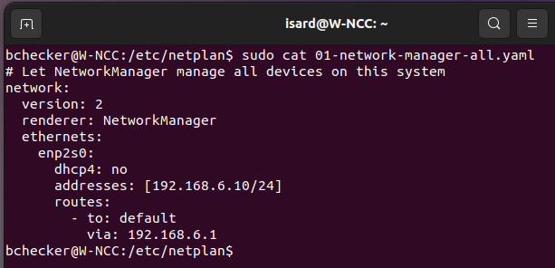

---

#### Pas 2: Proves de connectivitat des del servidor web

Proves de connectivitat mitjançant ping des del servidor web cap al servidor FTP (192.168.6.11) i cap al router (192.168.6.1). Ambdues proves mostren 0% packet loss confirmant la correcta configuració de xarxa a la DMZ.

---

#### Pas 3: Configuració de regles iptables al router per al servidor web

Configuració de les regles d'iptables al router R-N01 per permetre l'accés al servidor web. S'afegeixen regles INPUT per acceptar tràfic des de les xarxes DMZ (192.168.6.0/24) i Intranet (192.168.60.0/24), així com per a IPs específiques del web server (192.168.6.10 i 192.168.6.11).

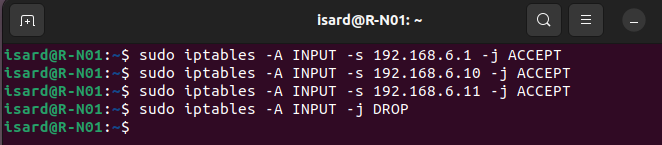

---

#### Pas 4: Instal·lació i verificació del servei Apache2

Instal·lació del servidor Apache2 i verificació que el servei està actiu (active/running) des del 10 de novembre. Es mostra l'estat del servei amb PID 2266 i el hostname del servidor 192.168.121.26 192.168.6.10.

---

#### Pas 5: Configuració del firewall UFW i SSL

Verificació de l'estat del servei Apache2, configuració del hostname, habilitació de la regla UFW per "Apache Full" (ports 80 i 443), i habilitació dels mòduls SSL necessaris (ssl, socache_shmcb). El servei està actiu i escoltant en múltiples ports incloent 80, 443 i [::]:22.

---

#### Pas 6: Habilitació de mòduls SSL i configuració del lloc per defecte

Execució de la comanda `sudo a2enmod ssl` per habilitar els mòduls SSL (setenvif, mime, socache_shmcb, ssl). Després s'habilita el lloc SSL per defecte amb `sudo a2ensite default-ssl.conf` i es recarrega Apache2. Es verifica la configuració amb `apache2ctl configtest` mostrant un warning sobre el ServerName.

---

#### Pas 7: Accés HTTP al servidor web des del navegador

Accés al servidor web mitjançant el navegador Firefox a l'adreça http://192.168.6.10 mostrant la pàgina per defecte d'Apache2 Ubuntu. Es visualitza la pàgina de benvinguda confirmant que el servidor web està operatiu i accessible des de la xarxa.

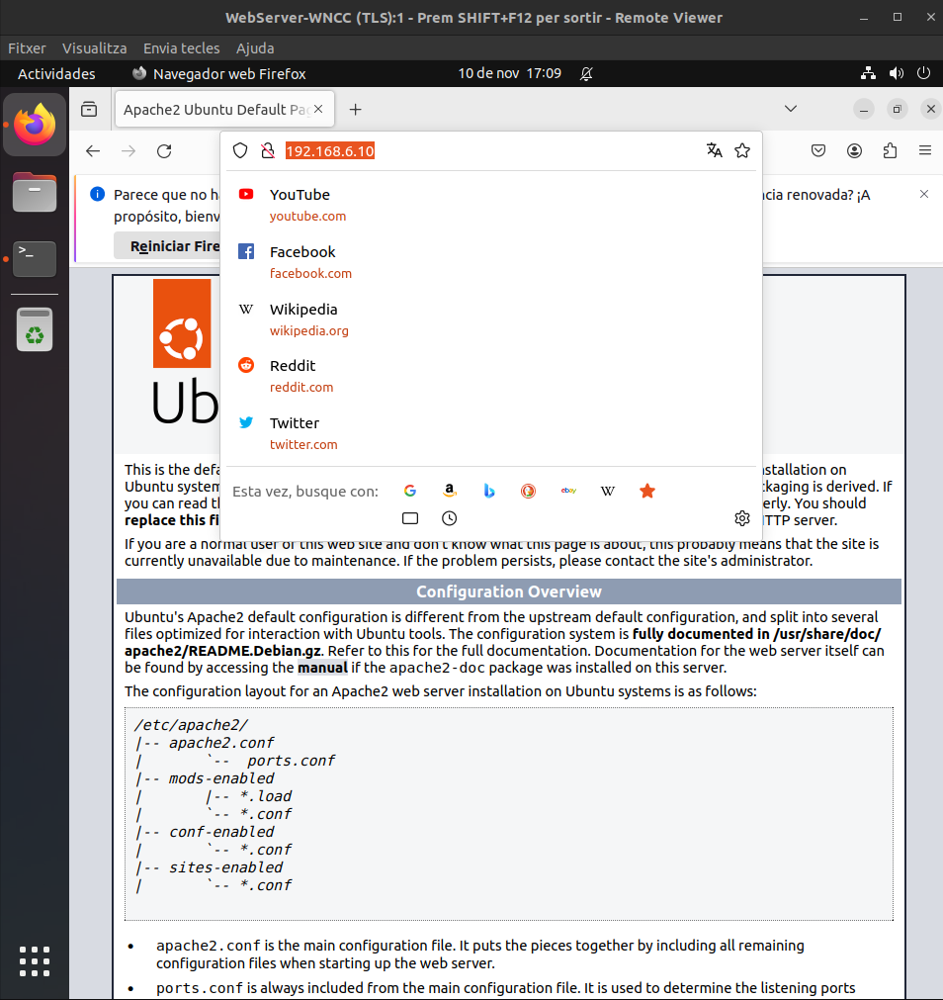

---

#### Pas 8: Advertència de seguretat al accedir per HTTPS

Intent d'accés al servidor web mitjançant HTTPS (https://192.168.6.10). Firefox detecta un risc de seguretat potencial perquè el certificat SSL és autosignat (self-signed). Es mostra l'error "MOZILLA_PKIX_ERROR_SELF_SIGNED_CERT" amb opcions per retrocedir o acceptar el risc.

---

#### Pas 9: Accés HTTPS exitós després d'acceptar el certificat

Després d'acceptar el risc de seguretat, s'accedeix correctament al servidor web per HTTPS (https://192.168.6.10) mostrant la mateixa pàgina per defecte d'Apache2 Ubuntu. Això confirma que el servidor està funcionant tant en HTTP com en HTTPS.

---

#### Pas 10: Configuració del servei SSH

Verificació de l'estat del servei SSH amb `sudo systemctl status ssh` mostrant que està actiu des de les 17:02. Es configura el fitxer `/etc/ssh/sshd_config`, es reinicia el servei, i s'afegeix la regla UFW per permetre el port 2222/tcp. L'estat del firewall mostra les regles actives per Apache Full i SSH (port 2222).

---

#### Pas 11: Configuració detallada del fitxer sshd_config

Visualització del fitxer de configuració `/etc/ssh/sshd_config` amb nano mostrant els paràmetres principals: Port 2222, autenticació per clau pública habilitada (PubkeyAuthentication yes), login de root deshabilitat (PermitRootLogin no), i configuració de logging i autenticació.

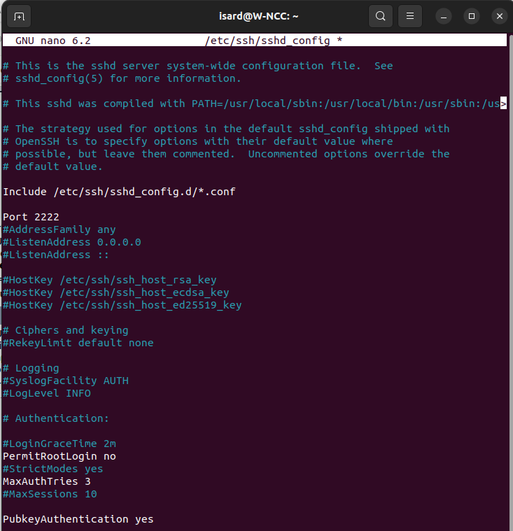

---

#### Pas 12: Configuració d'iptables al router per SSH

Configuració de les regles d'iptables al router R-N01 per permetre l'accés SSH al servidor web. S'afegeixen regles INPUT per permetre: loopback, connexions establertes, ping (ICMP), SSH al router (port 22), accés des de les xarxes DMZ i Intranet, i accés a IPs específiques del web server. També s'afegeix una regla FORWARD bidireccional entre les xarxes DMZ i Intranet.

---

#### Pas 13: Configuració del forwarding IPv4 al router

Edició del fitxer `/etc/sysctl.conf` al router amb nano per habilitar el forwarding de paquets IPv4. Es descomenta la línia `net.ipv4.ip_forward=1` per permetre que el router encamini paquets entre diferents interfícies de xarxa.

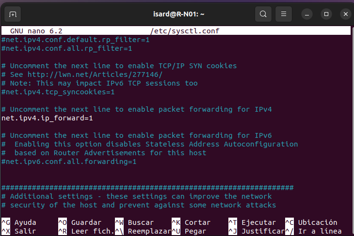

---

#### Pas 14: Creació i habilitació del servei de persistència d'iptables

Creació de l'script `/usr/local/bin/iptables-rules.sh` i del servei systemd `/etc/systemd/system/iptables-rules.service` per fer persistents les regles d'iptables. S'habilita i s'inicia el servei amb `systemctl enable/start iptables-rules.service`. La verificació mostra que el servei està actiu (active/exited) i s'ha carregat correctament.

---

#### Pas 15: Creació del servei de ruta estàtica al router (Servidor Web)

Visualització del fitxer `/etc/systemd/system/add-static-route.service` al servidor web (W-NCC) que configura una ruta estàtica cap a la xarxa Intranet (192.168.60.0/24) via el router (192.168.6.1). Aquest servei s'executa després de la xarxa estar disponible.

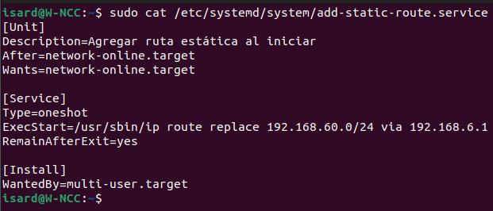

---

#### Pas 16: Verificació del servei de ruta estàtica

Comprovació del contingut del fitxer `/etc/systemd/system/add-static-route.service` al servidor de base de dades (B-N06) amb una configuració similar, establint la ruta estàtica cap a la xarxa DMZ (192.168.6.0/24) via el router de la Intranet (192.168.60.1).

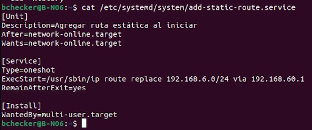

---

#### Pas 17: Connexió SSH des del servidor FTP al Web Server

Connexió SSH exitosa des del servidor FTP (F-NCC) al servidor web utilitzant el port 2222 amb la comanda `ssh -p 2222 bchecker@192.168.6.10`. S'accedeix correctament al sistema Ubuntu 22.04.4 LTS mostrant informació de documentació, management i suport. El darrer login va ser des de 192.168.6.11.

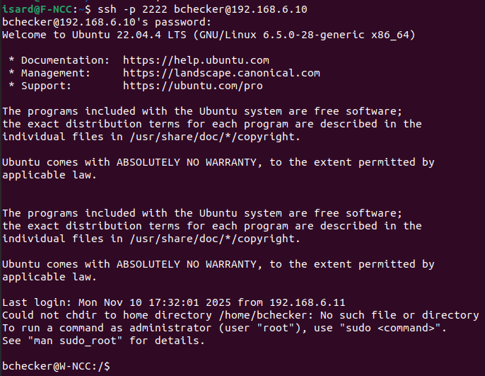

---

#### Pas 18: Configuració del DirectoryIndex per PHP

Edició del fitxer `/etc/apache2/mods-enabled/dir.conf` amb nano per configurar l'ordre del DirectoryIndex. S'estableix que index.php tingui prioritat sobre els altres fitxers d'índex (index.html, index.cgi, etc.).

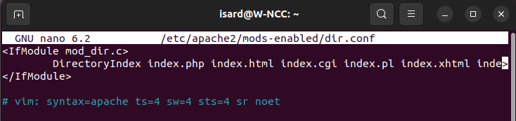

---

#### Pas 19: Verificació de la instal·lació de PHP

Comprovació de la versió de PHP instal·lada mostrant PHP 8.1.2-1ubuntu2.22 amb Zend Engine v4.1.2 i Zend OPcache v8.1.2. S'executa la comanda `php -m | grep -E 'mysqli|pdo'` per verificar que els mòduls mysqli i pdo_mysql estan instal·lats correctament.

---

#### Pas 20: Creació de l'arxiu test.php i configuració de permisos

Creació de l'arxiu `/var/www/html/test.php` amb la funció `phpinfo();` per mostrar la informació de configuració de PHP. Es configuren els permisos adequats amb `chown www-data:www-data` i `chmod 644`. Es verifica el contingut del fitxer mostrant el codi PHP bàsic.

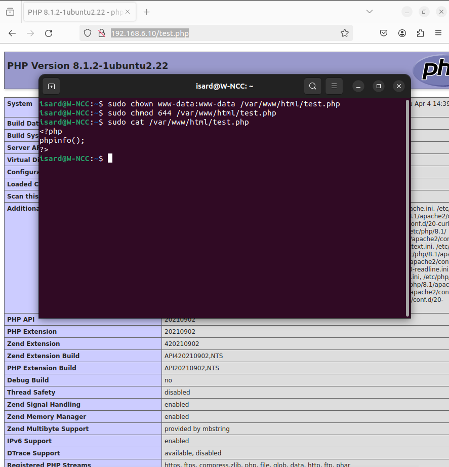

---

#### Pas 21: Accés web a test.php i verificació de PHP

Accés mitjançant el navegador a http://192.168.6.10/test.php mostrant la pàgina d'informació de PHP (phpinfo). Es visualitza la versió PHP 8.1.2-1ubuntu2.22 amb informació detallada del sistema, build date, server API, directives de configuració, PHP Extension, Zend Extension i altres paràmetres de configuració de PHP.

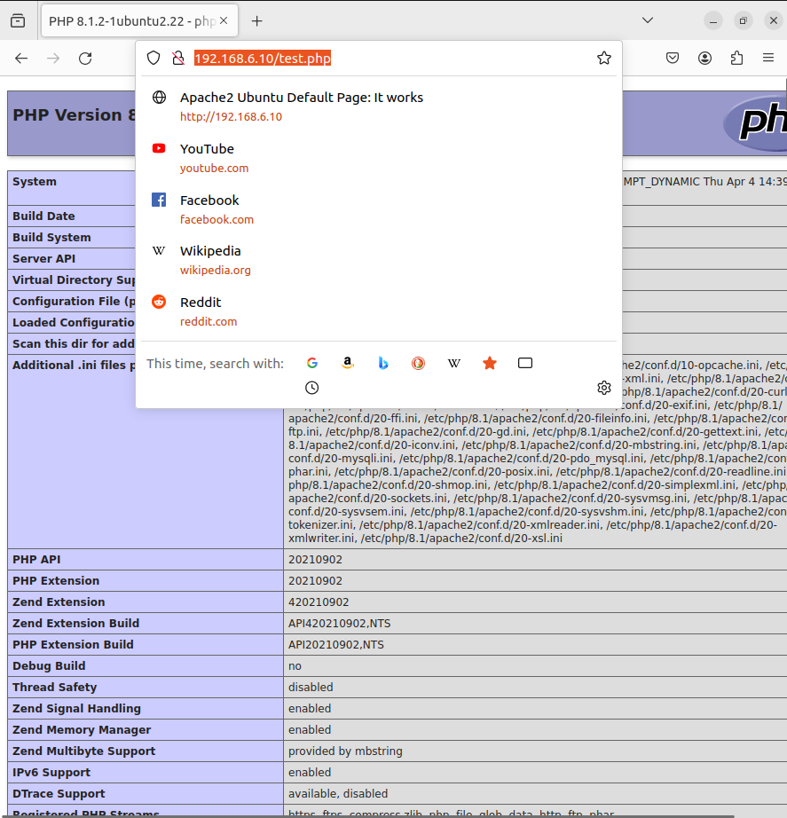

---

#### Pas 22: Detall complet de la configuració PHP

Vista ampliada de la pàgina phpinfo() mostrant informació completa sobre la configuració de PHP incloent: System, Build Date, Build System, Server API, Virtual Directory Support, Configuration File, Loaded Configuration File, extensions carregades, PHP API, PHP Extension, Zend Extension, Debug Build, Thread Safety, i altres paràmetres tècnics del servidor PHP.

---